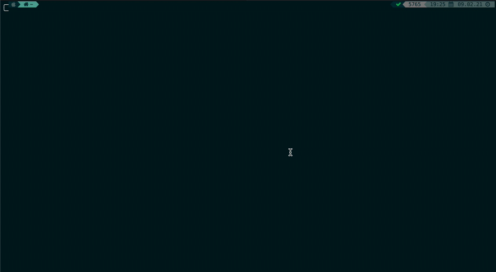

# grafana-cli

`grafana-cli` is a command line tool which allows you to execute actions against Grafana api server such as:

- List grafana alerts
- Pause grafana alerts
- Resume grafana alerts

<br>



<br><br>

## Getting Started

<br>

Clone this repo:

```sh
git clone https://github.com/orojina/grafana-cli.git
```

<br>

Copy the `.grafana` folder into your home directory:

```sh
cd grafana-cli
cp -r .grafana ~
cp grafana-cli.sh ~
```

<br>

Update the configuration files for each environment (if you have only one Grafana instance you can use the prod configuration file). The config files must follow the following format; all fields are mandatory except for the `GF_EXCLUDE_ALERTS` variable which is optional.


<br>

**NOTE:** The image shows the following sections:
###  `[ENVIRONMENT]` 
This section contains:
1) The name of the Grafana environment (`dev` | `qa` | `prod`)
2) The grafana API server URL
3) The authorization header to be used on every HTTP request

<br>

**IMPORTANT:** Make sure there is a line break between organizations, so that the confirgurations can be parsed successfully.

<br>

**NOTE:** Don't change the section name; keep it as `[Environment]`
###  `[ORGANIZATION_A]` `[ORGANIZATION_B]` `[ORGANIZATION_N]`
These sections are intended to store the Grafana tokens for each Grafana Organization. In this example we are declaring 2 Grafana Organizations `ORGANIZATION_A` & `ORGANIZATION_B` but you can have more organizations and name them as you wish. The name you use as the section name is the name of the organization you will be using to load the environment variables using the following command in your terminal: 

```sh
    source ~/grafana-cli.sh config set-env dev ORGANIZATION_A
```

<br>

**NOTE:** The Grafana token must have the Grafana `admin` role of that organization.

**IMPORTANT:**  
* You should ask within your team if an API KEY already exists for your team usage.
* If you need to create a new API Token, please refer to the [Grafana documentation](https://grafana.com/docs/grafana/latest/http_api/auth/#create-api-token) for instructions on how to create the Grafana token. Be aware that you need to have Organization admin rights to create a new API Token.
* Make sure the token has the `admin` role attached.

<br><br>

### Dependencies

- `grafana-cli` requires [jq](https://stedolan.github.io/jq/download/) to be installed.

<br><br>

### How to use grafana-cli
Use the following command to see a list of available commands and how to use them

```sh
    ~/grafana-cli.sh -h
```


<br>

- **Load environment variables into your terminal session**
```sh
    source ~/grafana-cli.sh config set-env prod ORGANIZATION_A
```


<br>

- **Get a list of Grafana alerts**
```sh
    ~/grafana-cli.sh alerts
```


<br>

<br>

**Pro Tip:** use the following command to `watch` the status of your alerts; the alert list will be refreshed every 10 secs:

```sh
    watch -c -n 10 "~/grafana-cli.sh alerts"
```


<br><br>

- **Pause all alerts in the Grafana Organization**
```sh
    ~/grafana-cli.sh alerts pause
```


<br><br>

- **Pause specific alerts by alertId**
<br>

Use the `-i` option followed by the alert IDs you want `grafana-cli` to `pause`

```sh
    ~/grafana-cli.sh alerts pause -i 2,8,9
```


<br><br>

- **Add annotations**
<br>
Use the `-a` option followed by any text to add an annotation as part of the `pause/resume` action

```sh
    ~/grafana-cli.sh alerts pause -i 2,8,9 -a "Pausing alerts due maintenance activities"
```


<br><br>

- **Add alerts to the exclusion list**

`grafana-cli` allows you to set an exclusion list, which basically tells `grafana-cli` to ignore those alerts when pausing/resuming alerts.

<br>

All you need to do is to set the `GF_EXCLUDE_ALERTS` variable with the alert IDs you dont want `grafana-cli` to touch.


<br>

**Note:** Whenever you change a config file, you need to make sure to source the confige file in your terminal window, otherwise changes wont be applied.

```sh
    source ~/grafana-cli.sh config set-env dev ORGANIZATION_A
```


```sh
    ~/grafana-cli.sh alerts pause
```


<br>

**Note:** To resume alerts just change the pause command from `pause` to `resume`

